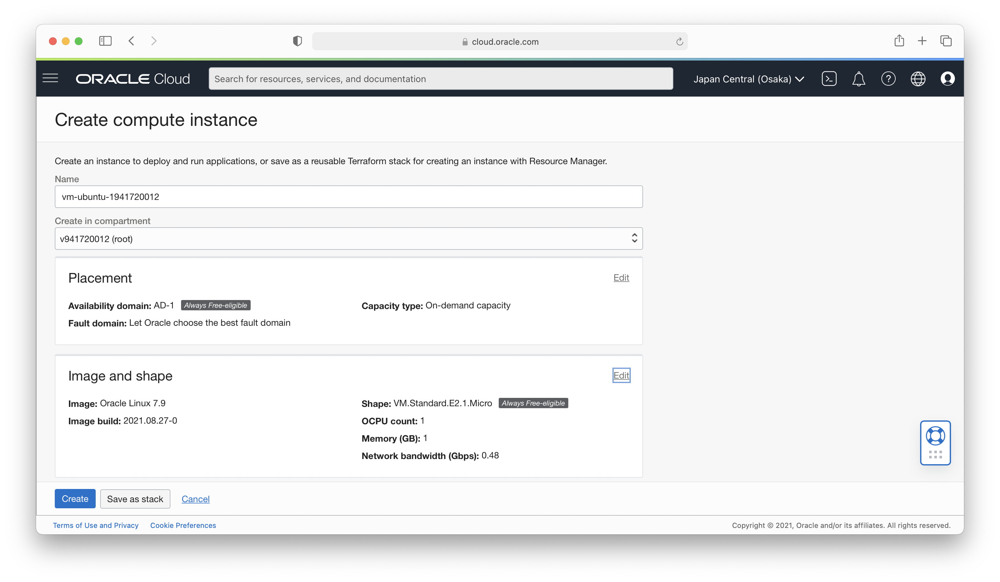

# 03 - Membuat Virtual Machine

## Tujuan Pembelajaran

1. ...
2. ...

## Hasil Praktikum

### Laporan Pembuatan Virtual Machine
1. Login ke dalam akun Oracle Cloud

2. Setelah berhasil login, masuk ke menu instance melalui pojok kiri atas

3. Membuat instance baru dengan cara klik tombol Create VM

4. Memberikan nama pada VM, yakni vm-ubuntu-1941720012

5. Memilih sistem informasi yang akan digunakan pada VM, yakni Canonical Ubuntu 20.04

6. Pada networking VM dibiarkan default, dan untuk SSH Key diunduh dan disimpan pada local pc.

7. Memilih kapasitas disk untuk VM. Seharusnya ini disesuaikan dengan kebutuhan, namun untuk praktikum ini menggunakan kapasitas default.

8. Setelah selesai semua untuk pengaturan VM dan menekan tombol create, akan ditampilkan VM yang masih dalam proses PROVISIONING.

9. Dan setelah proses selesai, VM akan auto running.

10. Jika VM tidak digunakan, jangan lupa untuk stop VM agar tidak menghabiskan credit.

### Melakukan SSH ke VM
1. Pastikan VM pada Oracle sudah pada status RUNNING

2. Buka terminal dan masuk pada hak akses sudo

3. Mengubah hak akses SSH key yang sudah di download pada saat pembuatan VM

4. Melakukan login menggunakan SSH key ke VM
