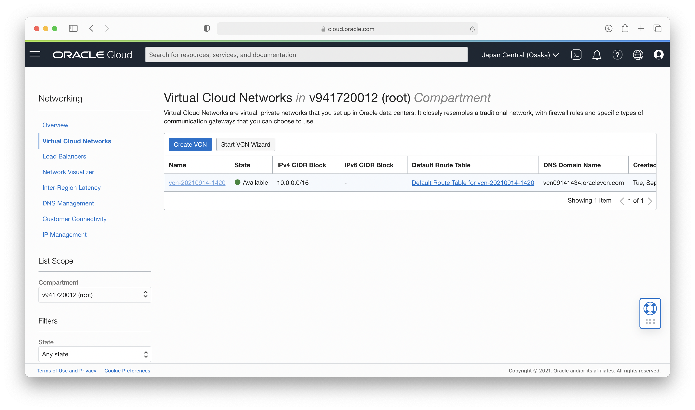
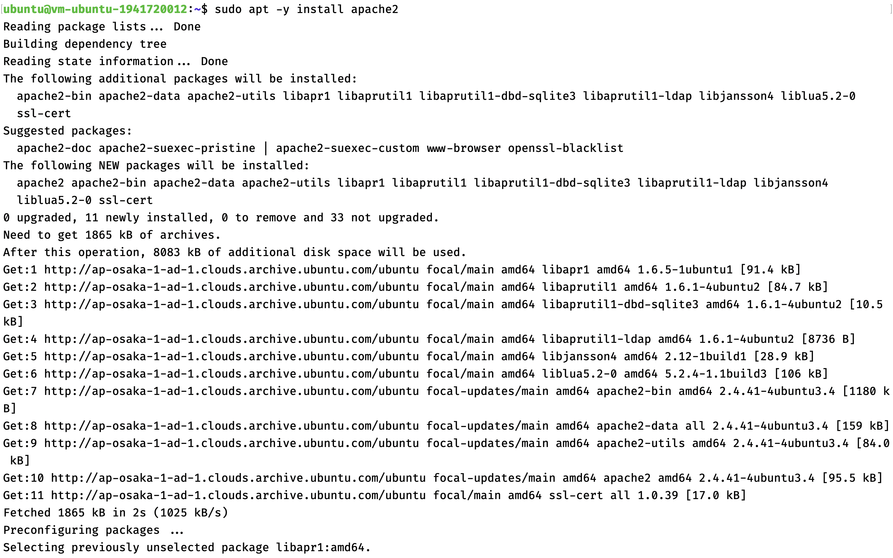
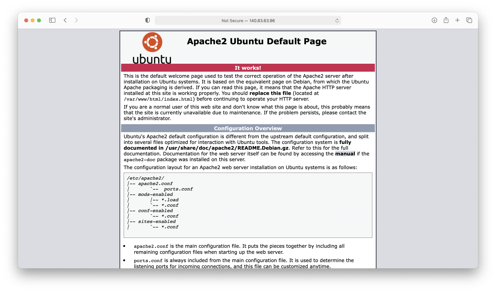

# 04 - Virtual Cloud Network

## Tujuan Pembelajaran

1. Mengetahui layanan Oracle Cloud Infrastructure Networking
2. Mampu mengaktifkan port 80 melalui Virtual Cloud Network (VCN) di layanan
Oracle Cloud
3. Mampu memasang Apache server dan mengonfigurasi IP tables Firewalls
## Hasil Praktikum

### Mengaktifkan Port 80 melalui VCN di Oracle Cloud
1. Login ke dalam akun Oracle Cloud

2. Masuk ke dalam Virtual Cloud Networks melalui pojok kiri atas halaman dashboard, kemudian pilih menu Networking > Virtual Cloud Networks

3. Pilih nama VCN yang tersedia, VCN tersebut berasal dari VM yang telah dibuat sebelumnya

4. Pilih Security Lists yang berada di sidebar Resources, kemudian pilih default security list yang tersedia

5. Menambahkan port dengan cara klik Add Ingress Rules

6. Mengisi form Ingress Rules sesuai modul

### Setup Apache di VM
1. Membuka instance yang sudah dibuat melalui menu Compute > Intances, start instances, dan copy ip public

2. Melakukan akses VM melalui SSH Key

3. Menginstall Apache server pada VM

4. Menjalankan service Apache

5. Mengaktifkan firewall pada VM

6. Menguji Apache server pada VM

### Intall PHP di VM
1. Melakukan sudo apt update

2. Menambahkan repository ppa:ondrej/php untuk instalasi php

3. Install php versi 8 pada vm

4. Cek versi php yang sudah terinstall pada vm

