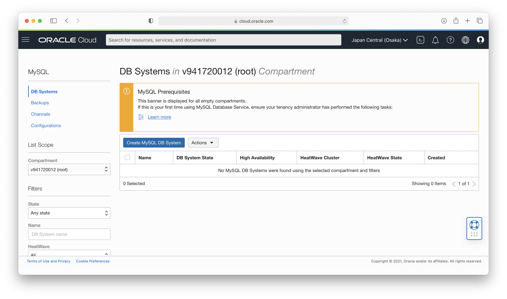
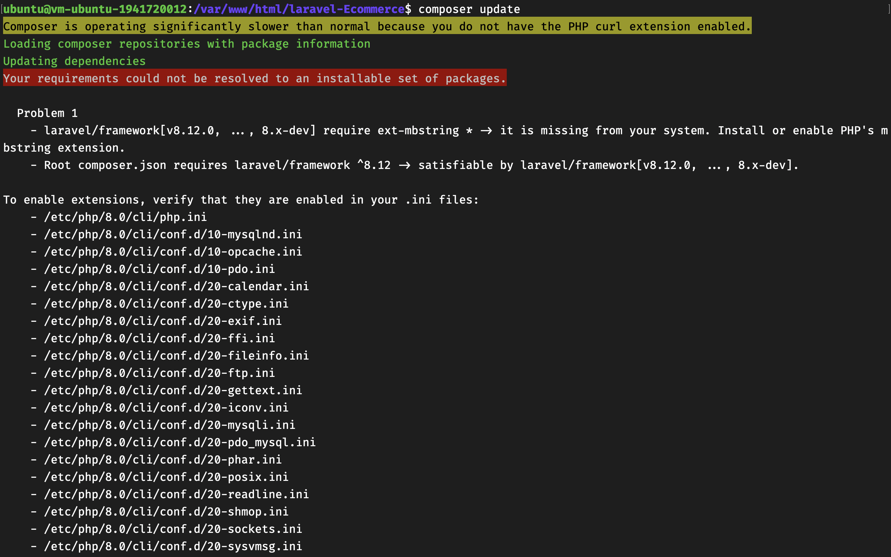

# 05 - PaaS (Platform as a Service)

## Tujuan Pembelajaran

1. Mengetahui layanan PaaS yang ditawarkan Oracle Cloud Infrastructure (OCI)
2. Dapat memanfaatkan layanan PaaS yang ditawarkan Oracle Cloud Infrastructure (OCI)

## Hasil Praktikum

### Membuat Databases
1. Memilih menu Database MySQL pada OCI

2. Membuat MySQL DB System

3. Setup Compartment, Name, Description, & Database Type untuk MySQL DB System

4. Setup Database Administrator

5. Setup VCN

6. Setup Availability Domain

7. Setup Shape Database

8. Setup Backup Database

9. Hasil Create Database


### Mengkonfigurasi Virtual Cloud Networks (VCN)

1. Memilih Menu VCN pada Networking

2. Memilih VCN yang Sudah Ada

3. Memilih Menu Security List dan Memilih Security List yang Sudah Ada

4. Menambah Ingress Rules pada Security Rules

5. Setup Ingress Rules


### Mengakses MySQL melalui SSH
1. Masuk ke instance melalui SSH

2. Mengakses MySQL. Pada pertama kali mengakses akan mendapatkan info jika ```command not found```, hal itu dikarenakan instance belum memiliki mysql-client sehingga tidak dapat mengakses mysql. Untuk itu diperlukan menginstall mysql-clien terlebih dahulu menggunakan perintah ```sudo apt install mysql-client-core-8.0```

3. Mengakses kembali mysql setelah menginstall mysql-client


### Tugas Praktikum PaaS
1. Membuat database untuk project yang akan di upload ke vm

2. Masuk ke direktori ```/var/www/html``` dan melakukan clone terhadap project yang sudah ada di GitHub

3. Masuk ke direktori hasil clone dan menjalankan composer install. Perlu menjalankan composer install dikarenakan project yang diupload ialah project yang menggunakan teknologi Laravel. Namum pada saat akan menjalankan composer install terdapat pesan jika ```command not found```, maka dari itu perlu untuk menginstall composer terlebih dahulu

4. Install php-cli unzip sebelum menginstall composer

5. Install composer

6. Hasil installasi composer

7. Masuk kembali ke direktori project dan menjalankan composer install. Akan terdapat error lagi dikarenakan terdapat beberapa library yang tidak support sehingga diperlukan ```composer update```.

8. Menjalankan perintah ```composer update``` dan selamat datang di error selanjutnya hehehe. Maksud dari error tersebut adalah sistem memerlukan ekstensi php-mbstring sehingga perlu menginstall ekstensi tersebut

9. Sebelum install php-mbstring, install terlebih dahulu php8.0-curl. Sesuaikan dengan versi php yang terinstall.

10. Menginstall php-mbstring

11. Menginstall php-xml

12. Melakukan ```composer update``` lagi dan Alhamdulillah sudah terbebas dari error 😊

13. Buka project menggunakan vim

14. Hasil project jika dibuka menggunakan vim

15. Buka file ```.env.example``` dan setup file seperti berikut. Sesuaikan DB_HOST, DB_DATABASE, DB_USERNAME, dan DB_PASSWORD

16. Setelah selesai konfigurasi file ```.env.example```, simpan hasil konfigurasi tersebut dengan nama ```.env```

17. Menjalankan perintah ```php artisan key:generate```

18. Melakukan migrasi table ke database yang sudah dibuat sebelumnya

19. Hasil dari migrasi table

20. Melakukan konfigurasi pada file apache2.conf

21. Menambahkan direktori baru dengan akses AllowOverride ALL

22. Restart apache

23. Hasil project ketika dijalankan di browser

24. Dashboard setelah login admin

25. Salah satu fitur CRUD dalam project


