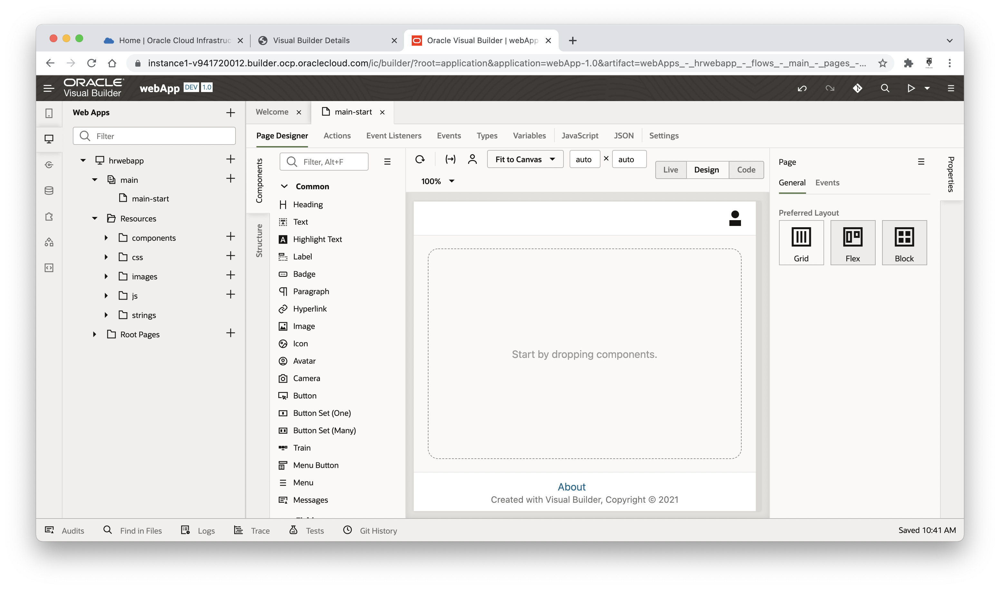
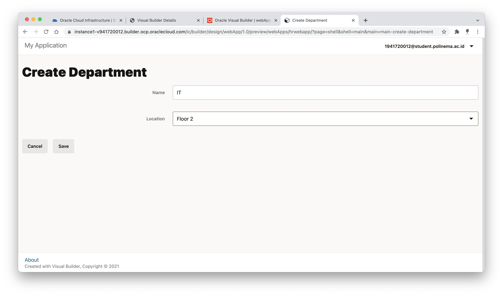
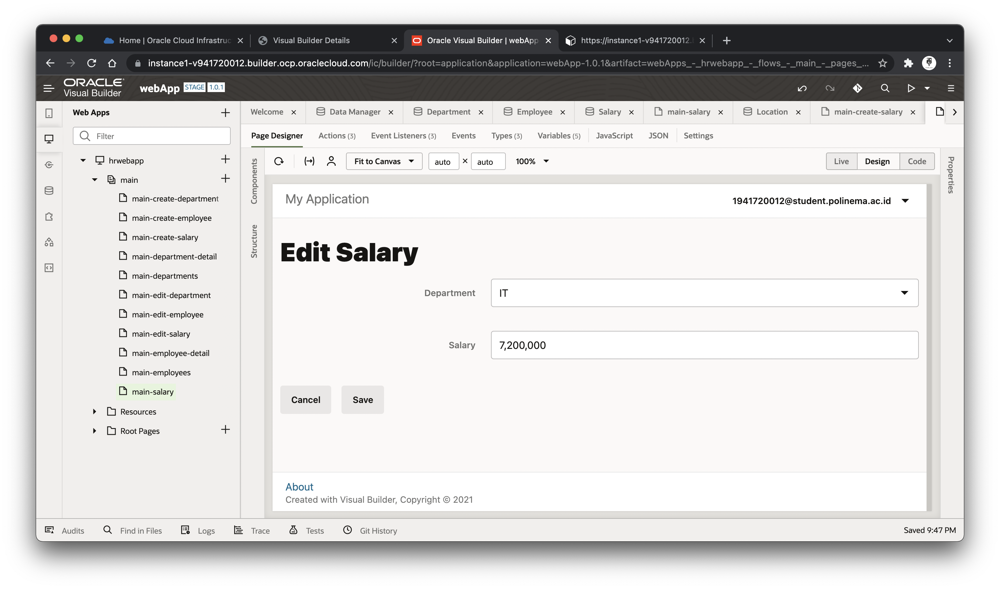
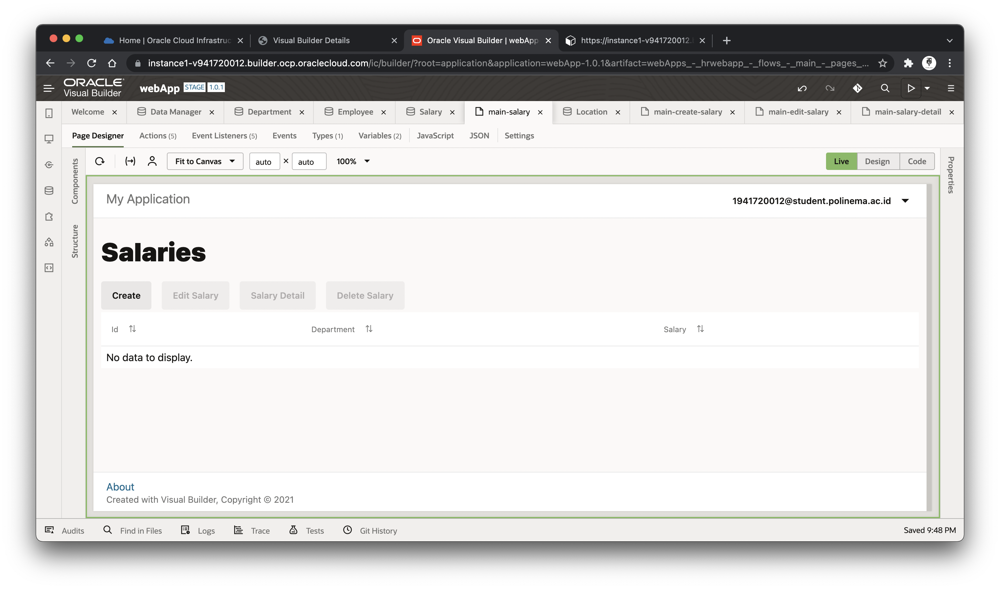

# 07 - SaaS (Software as a Service)

## Tujuan Pembelajaran

1. Mengetahui layanan Oracle Cloud Infrastructure Software as a Service.
2. Mampu menggunakan layanan software oracle.

## Hasil Praktikum

### Membuat Aplikasi (Create Web Application)
1. Masuk ke halaman Visual Builder melalui OCI Classic Services -> Visual Builder

2. Membuat instance baru pada visual builder

3. Mengisi detail instance yang akan dibuat

4. Pada step confirm bisa langsung next untuk menyelesaikan proses pembuatan instance

5. Tunggu sampai status instance berubah menjadi "Ready" agar instance dapat digunakan

6. Membuka Visual Builder Home Page pada instance yang telah berhasil dibuat

7. Buat aplikasi baru melalui halaman awal Visual Builder Home Page

8. Mengisi informasi aplikasi yang akan dibuat

9. Setelah berhasil membuat aplikasi baru, akan diarahkan pada halaman berikut

10. Memilih Web Application pada bagian sidebar dan membuat aplikasi web yang baru

11. Mengisi detail dari aplikasi web yang akan dibuat

12. Hasil setelah aplikasi web berhasil dibuat

### Import Location Business dari File

1. Memilih Business Object pada bagian sidebar dan membuat business object yang baru

2. Mengisi dialog box Business Object dengan "Location"

3. Masuk pada tab "Field" dan membuat field baru untuk menyimpan data nama (Name)

4. Setting nama agar field bersifat "Required"

5. Masuk pada data manager untuk melakukan manajemen data

6. Memilih menu "Import from File" untuk memasukkan data melalui file .csv

7. Memasukkan file Location.csv yang sudah tersedia pada resources jobsheet ke dalam form import

8. Dialog box setelah proses import berhasil

9. Hasil data setelah proses import berhasil

### Department Business Object

1. Membuat Business Object baru dengan nama "Department"

2. Masuk pada tab "Field" dan membuat field baru untuk menyimpan data nama (Name)

3. Setting nama agar field bersifat "Required"

4. Membuat field baru untuk menyimpan data location (Location) dimana untuk field ini berelasi dengan Business Object Location

### Employee Business Object

1. Membuat Business Object baru dengan nama "Employee"

2. Masuk pada tab "Field" dan membuat field baru untuk menyimpan data nama (Name)

3. Setting nama agar field bersifat "Required"

4. Membuat field baru untuk menyimpan data department (Department) dimana untuk field ini berelasi dengan Business Object Department

5. Membuat field baru untuk menyimpan data tanggal karyawan di rekrut (Hire Date)

6. Membuat field baru untuk menyimpan data email (Email)

7. Melihat Endpoints Business Object Employee

8. Melihat Endpoints Business Object Employee pada departmentObject

### Business Object Diagram

1. Membuat Business Object Diagram baru dengan nama "HRDiagram"

2. Menampilkan diagram relasi dengan centang semua business object yang sudah ada

### Halaman untuk Display Departments

1. Memilih sidebar Web Application dan menambahkan sebuah heading untuk menampilkan title "Departments" pada halaman main-start

2. Menambahkan tabel dan memilih menu "Add Data" pada Quick Start untuk mengambil data dari Business Object Department

3. Memilih Business Object yang akan dijadikan source data tabel Departments

4. Memilih field yang akan ditampilkan atau dijadikan kolom pada tabel. Pada praktikum ini yakni id, name, dan name (yang ada di locationObject)

5. Langsung klik finish untuk bagian ini

6. Mengedit nama kolom "Name" yang berasal dari Location Object menjadi "Location"

### Halaman untuk Create Department

1. Memilih menu "Add Create Page" pada Quick Start table

2. Memilih Business Object untuk menyimpan data dari halaman create, yakni "Department"

3. Memilih field yang dapat diisi melalui halaman Create Department. Pada praktikum ini memilih name dan location. Pada langkah ini juga dapat mengubah nama button yang akan mengarahkan ke halaman create department

4. Setelah selesai membuat Create Page, akan dibuatkan main-create-department

5. Test proses create menggunakan fitur Live

6. Setelah klik tombol save pada halaman create department, akan diarahkan pada halaman flow diagram

7. Hasil data pada tabel setelah proses create department berhasil

### Halaman untuk Display Employees

1. Membuat halaman dengan nama "main-employee"

2. Setup data pada tabel agar terhubung dengan business object Employee

4. Memilih field yang akan ditampilkan pada tabel, yakni id, name, hireDate, email, dan name (yang ada di departmentObject)

5. Klik finish pada halaman ini

6. Ubah nama kolom "name" yang berasal dari departmentObject menjadi "Department"

7. Hasil display untuk employees

### Halaman untuk Create Employee

1. Memilih menu "Add Create Page" pada Quick Start table

2. Memilih Business Object untuk menyimpan data dari halaman create, yakni "Employee"

3. Memilih field yang dapat diisi melalui halaman Create Employee, yakni name, hireDate, email, dan department

4. Test proses create menggunakan fitur Live

5. Melihat isi kodingan dari halaman main-employees

6. Melihat struktur desain dari halaman main-employees

### Mengganti Nama Halaman main-start

1. Klik kanan pada main-start dan memilih menu Rename

2. Mengubah nama "main-start" menjadi "main-departments"

3. Memastikan pada file main-flow.json jika default halaman sudah bukan "main-start" melainkan "main-departments"

### Action Chain Display Departments ke Display Employees

1. Menambahkan komponen button dan memberikan event "On 'ojAction'"

2. Memberikan navigate ke halaman "main-employees"

3. Test Action Chain menggunakan preview mode
    - Menambahkan department baru

    - Halaman display employees yang dipanggil melalui halaman display departments

    - Menambahkan employee baru

### Action Chain Display Employees ke Display Departments

1. Untuk langkah-langkahnya sama seperti sebelumnya, yang membedakan hanya dibagian navigate yang mengarahkan pada halaman "main-departments"

2. Hasil pada preview mode

### Import Data ke Business Object

1. Import data Department
    - Memilih business object "Department" dan masuk pada tab Data, lalu memilih button "Import from File"

    - Memilih file yang akan di import, yakni "Department.csv"

    - Proses import berhasil

    - Hasil data department setelah proses import berhasil

2. Import data Employee
    - Memilih business object "Employee" dan masuk pada tab Data, lalu memilih button "Import from File"

    - Memilih file yang akan di import, yakni "Employee.csv"

    - Proses import berhasil

    - Hasil data employee setelah proses import berhasil

### Halaman untuk Edit Department

1. Memilih "Add Edit Page" pada tab Quick Start yang ada di dalam komponen tabel

2. Memilih business object yang akan di edit, yakni "Department"

3. Memilih field yang dapat di edit melalui halaman edit department

4. Jika belum memilih data yang ada di dalam tabel, button "Edit Department" akan berada di dalam kondisi "Disable"

### Halaman untuk Detail Department

1. Memilih menu "Add Detail Page" pada tab Quick Start komponen tabel

2. Memilih business object "Department"

3. Memilih field yang akan ditampilkan pada halaman detail, yakni department name dan location name

4. Jika belum memilih data, button "Detail Department" akan berada di state "Disable"

5. Ubah Label Hint dari "name" ke "Location"

### Delete Department

1. Memilih menu "Add Delete Action" pada tab Quick Start komponen tabel 

2. Memilih business object "Department"

3. Jika belum memilih data, button "Delete Department" akan berada di state "Disable"

### Test Fungsi CRUD Department

1. Display departments

2. Menambahkan department baru

3. Edit department

4. Detail department

5. Delete department

### Halaman untuk Edit Employee

1. Memilih "Add Edit Page" pada tab Quick Start yang ada di dalam komponen tabel

2. Memilih business object yang akan di edit, yakni "Employee"

3. Memilih field yang dapat di edit melalui halaman edit employee

4. Mengubah layout edit menjadi 2 kolom, yakni dengan cara mengubah jumlah "Column" pada "komponen Form Layout"

### Halaman untuk Detail Employee

1. Memilih menu "Add Detail Page" pada tab Quick Start komponen tabel

2. Memilih business object "Employee"

3. Memilih field yang akan ditampilkan pada halaman detail, yakni employee name, hireDate, email, dan department name

4. Ubah Label Hint dari "name" ke "Department"

### Delete Employee

1. Memilih menu "Add Delete Action" pada tab Quick Start komponen tabel 

2. Memilih business object "Employee"

3. Jika belum memilih data, button "Delete Employee" akan berada di state "Disable"

### Test Fungsi CRUD Employee

1. Display employees

2. Menambahkan employee baru

3. Edit employee

4. Detail employee

5. Delete employee

### Stage

1. Kembali ke halaman utama Visual Builder dan klik hamburger button yang ada di sebelah kanan nama aplikasi. Lalu pilih Stage

2. Memilih "Populate Stage with Development Data" untuk memulai stage beserta data yang sudah ada di dalam business object

3. Jika sudah, status aplikasi akan berubah menjadi "Stage"

4. Untuk membuka aplikasi dalam kondisi "Stage", tinggal klik "Stage" dan pilih nama aplikasi yang sudah dibuat, yakni "hrwebapp"

5. Hasil aplikasi yang dijalankan dalam status "Stage"

### Publish Application

1. Untuk mem-publish aplikasi yang sudah dibuat, caranya dengan klik hamburger button yang ada di sebelah kanan nama aplikasi. Sebelum melakukan publish, aplikasi harus sudah berada pada status "Stage"

2. Pilih "Include data from Stage" jika ingin mempublish aplikasi beserta data yang sudah masuk pada status "Stage"

3. Status akan berubah menjadi "Live" dan untuk membuka aplikasinya tinggal klik "Live" dan pilih aplikasi yang sudah dibuat, yakni "hrwebapp"

4. Hasil aplikasi pada status "Live"

### Import Data - Stage

1. Dikarenakan aplikasi sudah dalam kondisi "Live", maka untuk melakukan perubahan perlu dibuat versi baru. Caranya dengan klik kembali hamburger icon yang ada di sebelah kanan aplikasi dan pilih "New Version"

2. Jika sudah maka akan dibuatkan aplikasi baru dengan versi 1.0.1

3. Mengubah status aplikasi versi 1.0.1 ke dalam "Stage"

4. Pilih "Populate Stage with Development Data" agar data tetap ada

5. Masuk ke halaman setup aplikasi dan masuk ke Data Manager

6. Pastikan status sudah berubah menjadi "Staging" dan jika sudah maka dipilih menu "Import from File"

7. Pilih file zip yang berada pada file resources jobsheet 7

8. Info jika proses import berhasil

9. Data pada business object "Department" setelah proses import

10. Data pada business object "Employee" setelah proses import

## Tugas

### Membuat Business Object Salary

1. Membuat Business Object baru dengan nama "Salary"

2. Menambahkan field department yang berelasi dengan business object "Department"

3. Menambahkan field salary dengan tipe data number

4. Setup salary agar bersifat "Required"

5. Business Object Diagram setelah ditambah dengan business object "Salary"

### Membuat Halaman untuk Display Salaries

1. Membuat halaman baru dengan nama "main-salary" untuk display salaries

2. Menghubungkan tabel dengan business object "Salary"

3. Memilih field yang akan ditampilkan pada tabel, yakni id, department name, dan salary

4. Langsung Finish ajaa yaa...

5. Mengubah nama kolom field yang berelasi dengan department, dari "Name" menjadi "Department"

### Membuat Halaman untuk Create Salary

1. Pada Quick Start table, pilih "Add Create Page"

2. Memilih business object "Salary"

3. Memilih field untuk inputan form create salary, yakni department dan salary

4. Hasil halaman create salary

5. Test create salary baru dengan "Live Mode"

### Membuat Halaman untuk Edit Salary

1. Memilih menu "Add Edit Page" pada Quick Start tabel

2. Memilih business object "Salary"

3. Memilih field untuk inputan form edit salary, yakni department dan salary

4. Hasil halaman edit salary

### Membuat Halaman untuk Detail Salary

1. Memilih menu "Add Detail Page" pada Quick Start tabel

2. Memilih business object "Salary"

3. Memilih field yang akan ditampilkan pada halaman detail Salary, yakni, department name dan salary

4. Mengubah Label Hint dari relasi object "Department", yakni dari "Name" menjadi "Department"

### Membuat Delete Action pada Salary

1. Pada Quick Start tabel, pilih menu "Add Delete Action"

2. Memilih buiness object "Salary"

3. Test delete salary menggunakan "Live Mode"

### Test CRUD Salary dengan mode Live

1. Menambahkan data baru salary

2. Menampilkan data salary pada tabel

3. Edit salary

4. Detail salary

5. Delete salary

