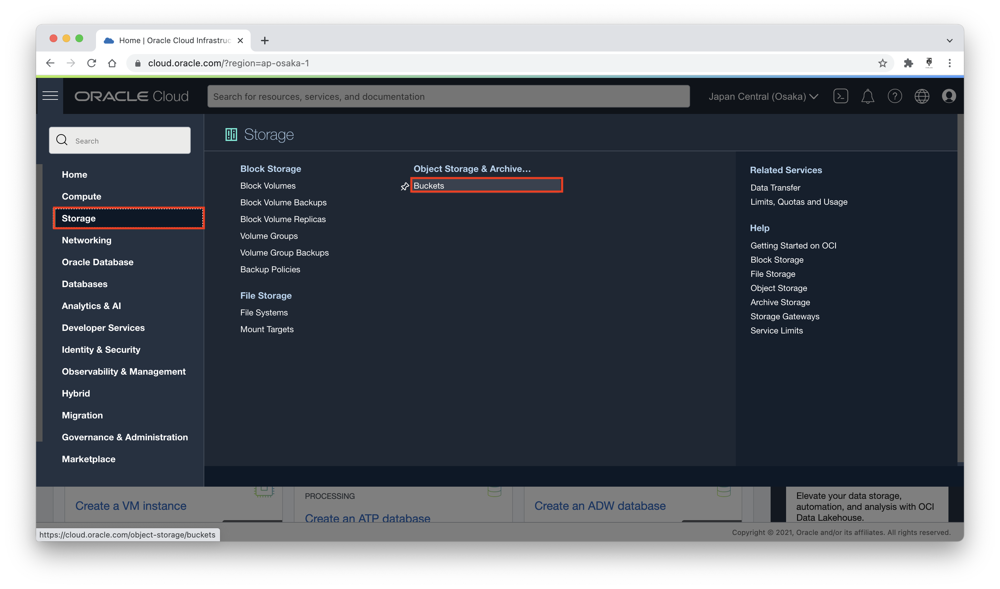
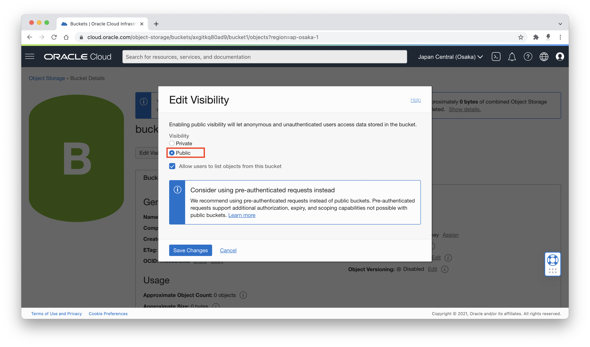

# 08 - Object Storage

## Tujuan Pembelajaran

## Hasil Praktikum

### Membuat Aplikasi (Create Web Application)
1. Memilih menu Storage untuk membuat bucket

2. Membuat bucket

3. Setup bucket detail


4. Masuk ke detail bucket

5. Edit visibility bucket agar menjadi public


6. Upload object ke dalam buckets

7. Upload resources file yang sudah disediakan


8. Melihat detail object untuk index.html

9. Copy url path pada file index.html

10. Hasil menjalankan url yang sudah di copy sebelumnya di browser


### Tugas

1. Membuat folder baru dengan nama ```tugas``` untuk menampung object tugas


2. Di dalam folder tugas, membuat folder baru dengan nama ```assets``` untuk menampung assets yang dibutuhkan.

3. Di dalam folder ```assets```, membuat tiga folder baru untuk mengelompokkan assets yang dibutuhkan, seperti css, images, dan js


4. Upload file css pada folder ```tugas/assets/css```


5. Upload file images pada folder ```tugas/assets/images```


6. Upload file js pada folder ```tugas/assets/js```


7. Upload file html pada folder ```tugas```


8. Buka file index.html melalui URL Path yang dapat dilihat melalui View Object Detail


9. Hasil website yang telah di upload pada buckets


