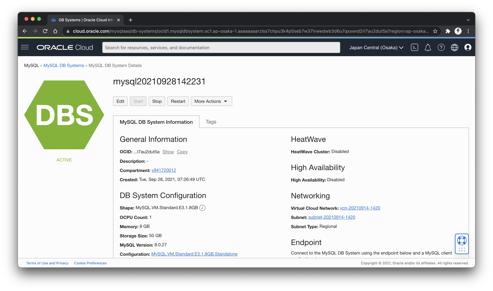
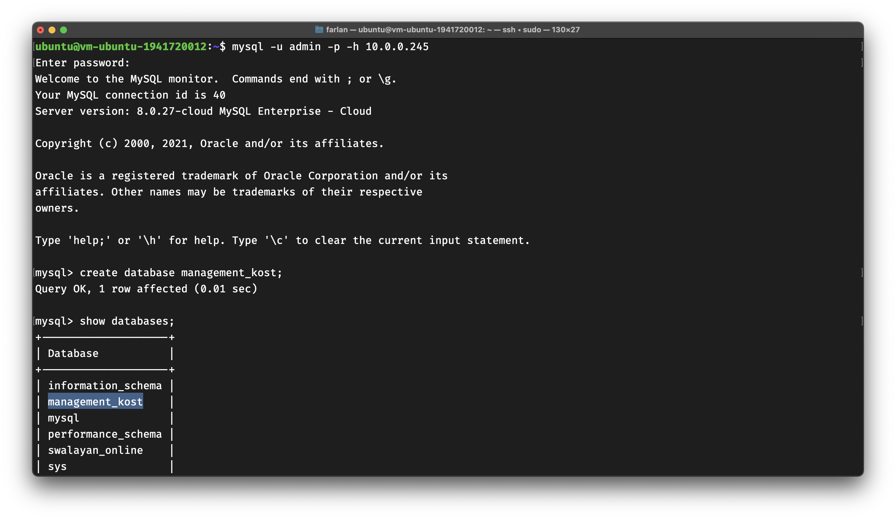
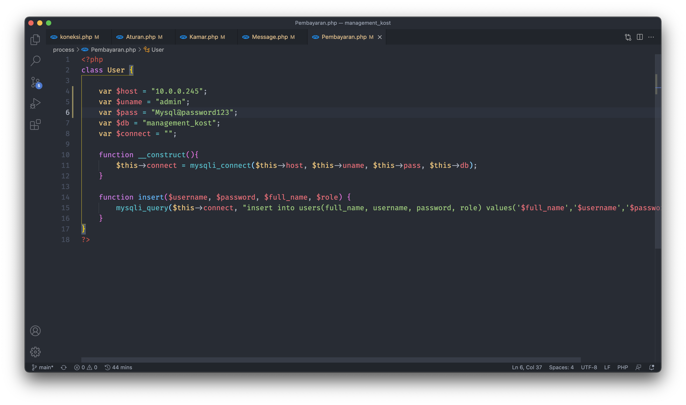
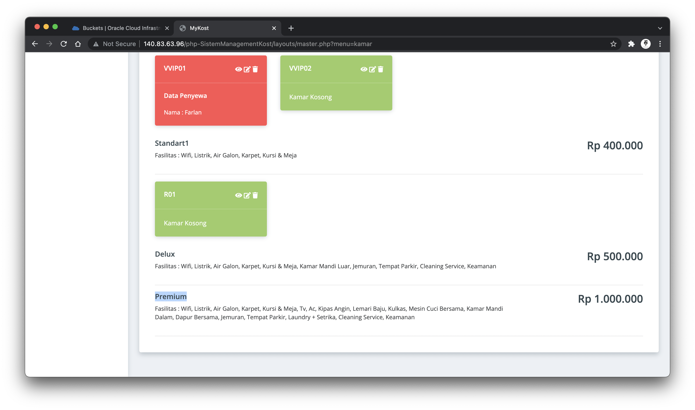

# 09 - UTS

## Memanfaatkan VM, Database Instance, dan Object Storage untuk Deploy Website
1. Memastikan VM Instance dan Database Instance sudah dalam keadaan running dan active


2. Mengakses VM Instance melalui SSH

3. Membuat database baru dengan nama "management_kost" pada Database Instance untuk menyimpan data website dinamis yang akan diupload

4. Melakukan ```git clone``` untuk mengambil project yang ada di GitHub dan di simpan pada direktori ```/var/www/html```

5. Melakukan import database dari file sql yang terdapat pada project ke dalam database management_kost yang ada di database instance

6. Memastikan import database berhasil dengan melihat daftar tabel yang ada di database management_kost

7. Menghapus folder ```assets``` pada project dikarenakan folder ini tidak akan digunakan dan isi dari folder tersebut akan di-upload pada object storage

8. Membuat folder baru dengan nama uts untuk menyimpan semua file assets yang diperlukan pada project web management kost. Hasil dari isi folder uts tersebut sebagai berikut

9. Mengubah setiap file php yang terdapat proses import assets dengan menyesuaikan path dari object storage. Pada proses ini akan dilakukan melalui vscode untuk mempermudah dalam proses edit


10. Mengubah setup database pada setiap proses yang ada di dalam project. Proses pengubahan ini juga dilakukan di vscode agar lebih mudah





11. Menghapus folder pada VM instance dan melakukan clone kembali serta menghapus folder yang tidak diperlukan, seperti folder assets


12. Mencoba menjalankan project yang telah diupload ke VM Instance. Dapat dilihat tampilan tetap terlihat cantik meskipun tidak ada folder assets di dalam project. Hal tersebut membuktikan jika assets yang berada di dalam object storage terbaca pada project.


13. Mencoba fitur CRUD tipe kamar


14. Mencoba fitur CRUD penyewa, pada fitur ini tampilan belum ada dikarenakan data belum di parsing ke halaman index. Sehingga untuk membuktikan jika proses create berhasil dapat dilihat pada database instance melalui query.


