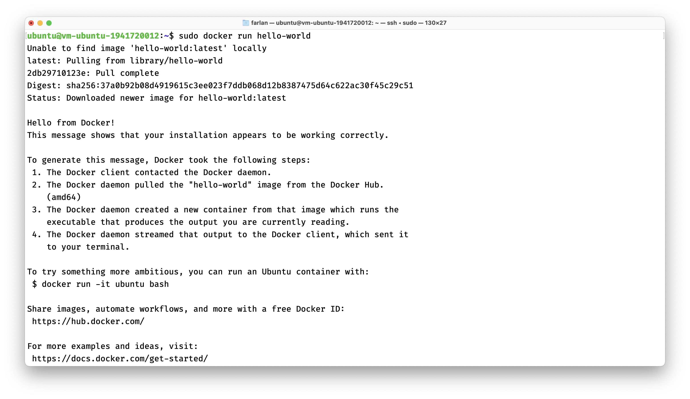
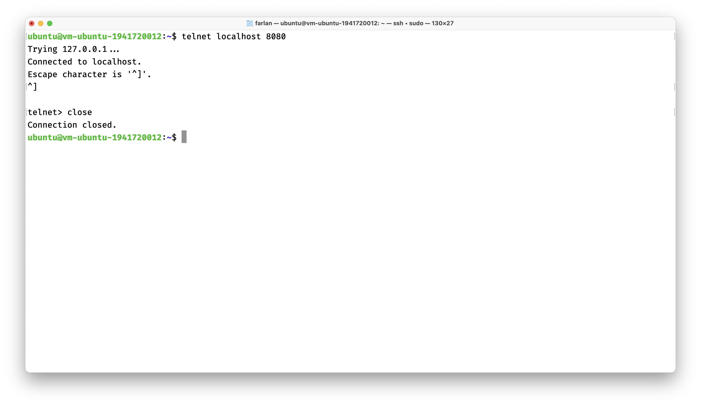
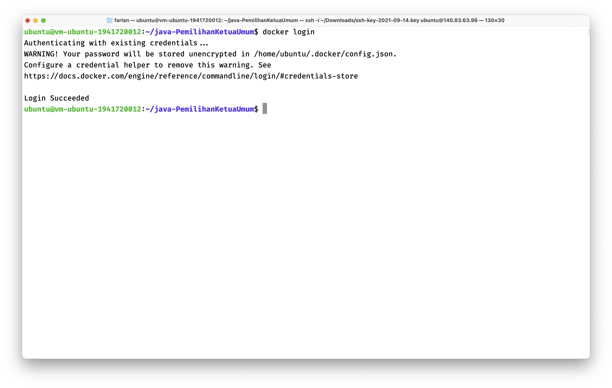

# 10 - Docker

## Tujuan Pembelajaran
1. Mengetahui perbedaan antara virtualisasi dengan container.
2. Mengetahui konsep docker dalam membangun sebuah aplikasi
3. Memanfaatkan container dalam membangun aplikasi
4. Mengetahui perintah dasar docker

## Hasil Praktikum

### Install Docker
1. Login ke dalam vm melalui ssh dan melakukan update sistem menggunakan perintah ```sudo apt update && sudo apt upgrade```


2. Instalasi paket yang dibutuhkan untuk menginstall docker

3. Menambahkan repository docker


4. Melihat status instalasi docker, pada output kali ini menunjukkan jika docker sudah tersedia di repository namun belum terinstall

5. Menginstall docker

6. Memastikan docker sudah berjalan menggunakan perintah ```systemctl```

7. Memastikan docker sudah terinstall menggunakan image test

8. Mengubah permission pada docker dan melakukan re-login untuk melihat perubahannya

9. Mencoba menjalankan docker tanpa menggunakan ```sudo```


### Membuat Container
1. Membuat container dengan apache

2. Testing container menggunakan telnet



### Membuat Akun Docker Hub
1. Register docker hub

2. Memilih plan, yakni free

3. Halaman awal atau dashboard docker hub

4. Halaman repository docker hub


### Build Image
1. Clone project gitlab

2. Masuk ke dalam folder hasil clone dan melakukan perubahan pada file Dockerfile

3. Mengubah isi dari Dockerfile menjadi seperti berikut

4. Melakukan build image

5. Menjalankan hasil build image

6. Login ke dalam akun docker hub melalui vm

7. Melakukan push atau upload project ke dalam docker hub

8. Hasil push atau upload project jika dilihat dari halaman repository docker hub


## Tugas

1. Melakukan clone project github

2. Masuk ke dalam folder hasil clone

3. Build image dari project yang sudah di clone

4. Menjalankan hasil build image

5. Melakukan login ke dalam docker hub, pada langkah ini tidak perlu memasukkan username dan password lagi dikarenakan sebelumnya sudah pernah login ke docker hub melalui vm

6. Melakukan push project ke docker hub

7. Hasil push project di docker hub repository
