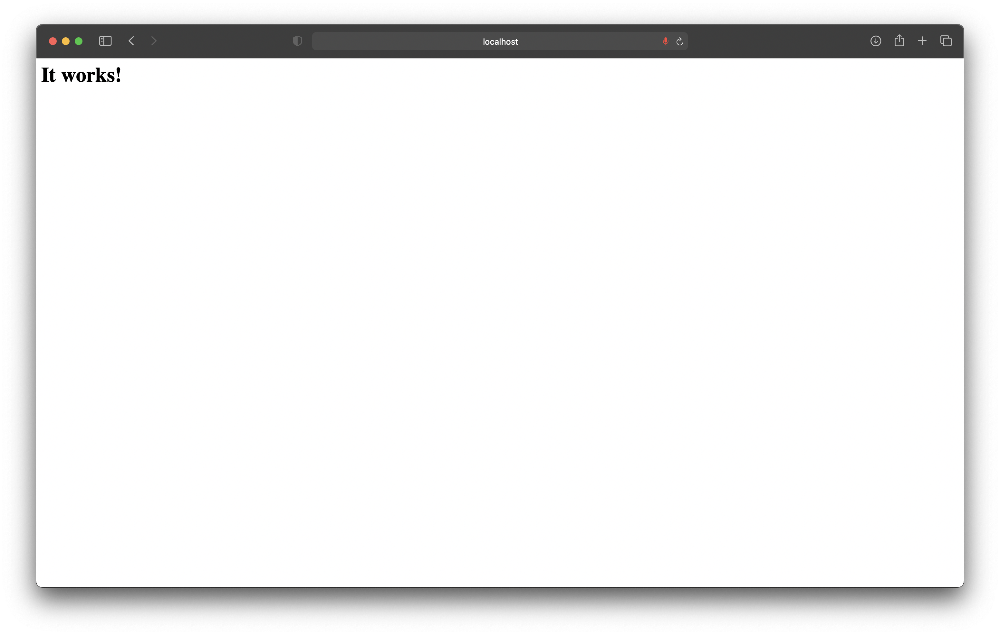

# 10 - Docker

## Tujuan Pembelajaran
1. Mahasiswa dapat mengetahui secara jelas network di Docker
2. Mahasiswa mengetahui konsep volume pada Docker
3. Mahasiswa mampu memanfaatkan dan menggunakan volume ataupun network ketika build image docker.
4. Mahasiswa bisa menggunakan docker compose dalam pembuatan aplikasi.

## Hasil Praktikum

### Docker Network

#### Membuat dan Memeriksa Docker Network
1. Melihat network yang tersedia pada docker host

2. Melihat perintah-perintah dasar yang dapat digunakan untuk docker network

3. Membuat network baru

4. Melihat docker yang sudah dibuat

5. Melihat informasi detail dari network yang sudah dibuat

#### Menghubungkan Container ke Network

1. Membuat container dengan nama container1 dan menggunakan image busybox

2. Membuat container dengan nama container2 dan menggunakan image alphine di terminal baru

3. Melihat status container yang sedang berjalan

4. Melihat informasi detail dari masing masing container

5. Membuktikan container yang sedang berjalan dengan melakukan ping

#### Membuka Port Container

1. Membuat image dari apache

2. Mengecek port yang di-expose menggunakan telnet

3. Mencoba menjalankan port yang sudah di-expose pada browser

4. Melihat daftar port yang di-expose pada container

### Docker Volume

#### Membuat Volume

1. Membuat folder docker-shared

2. Melakukan mapping ke container yang akan dibuat dan membuat file log.txt pada folder docker-shared

3. Mengecek isi folder docker-shared

4. Melihat daftar volume yang telah ada sebelumnya

5. Membuat volume baru

6. Menjalankan container dengan menyertakan volume yang sudah dibuat

7. Membuat container baru

#### Menghapus Volume

1. Menghapus volume

### Docker Compose

1. Install docker compose

2. Mengubah docker compose menjadi executable

3. Mengecek versi docker compose untuk memastikan docker-compose berhasil diinstall

4. Clone repo yang sudah disediakan

5. Masuk ke direktori hasil clone dan ganti branch ke cloud-docker

6. Membuka port 8090 pada vcn

7. Mengubah isi dari file docker-compose.yaml

8. Mengubah isi dari application.properties yang ada pada direktori src/main/resources

9. Build image

10. Membuat folder data pada direktori /opt agar mysql tidak hilang ketika container dihapus

11. Docker compose up

12. Menjalankan hasil docker-compose melalui browser

