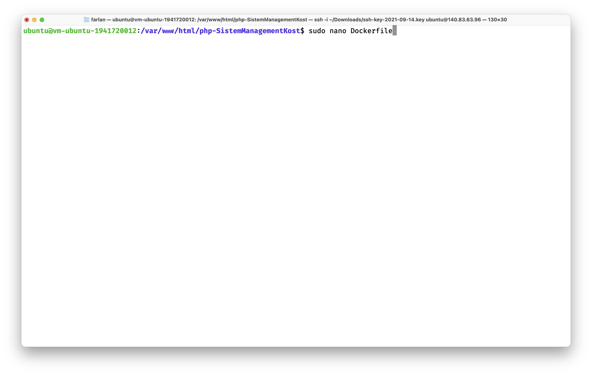
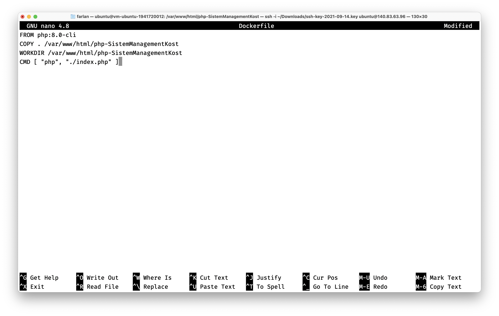
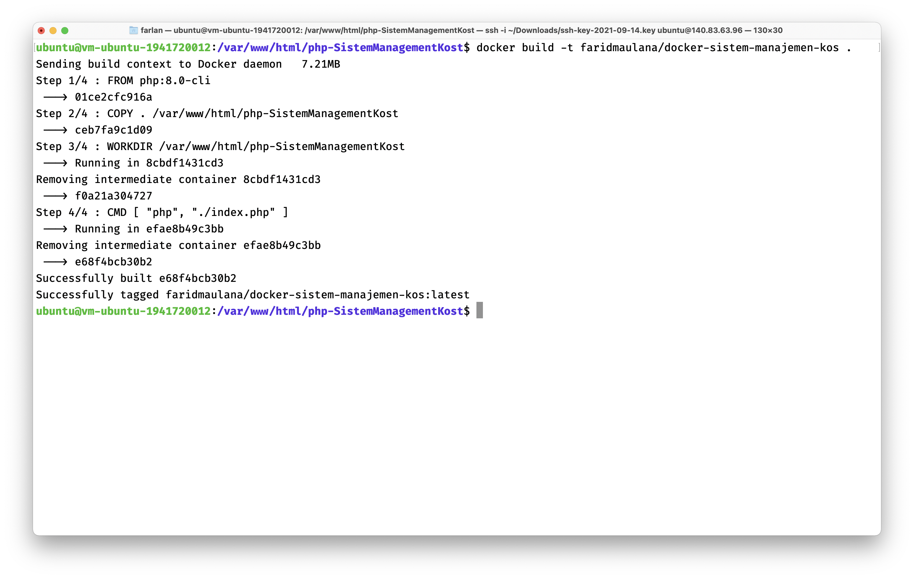
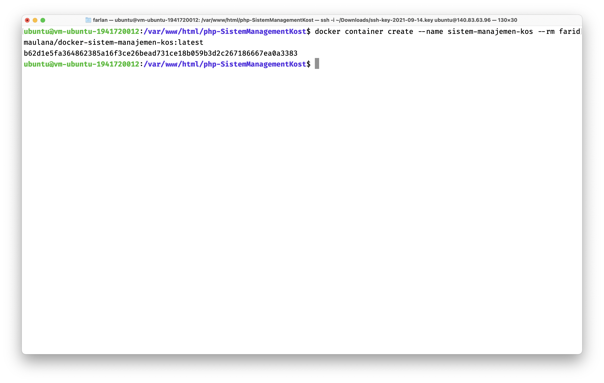
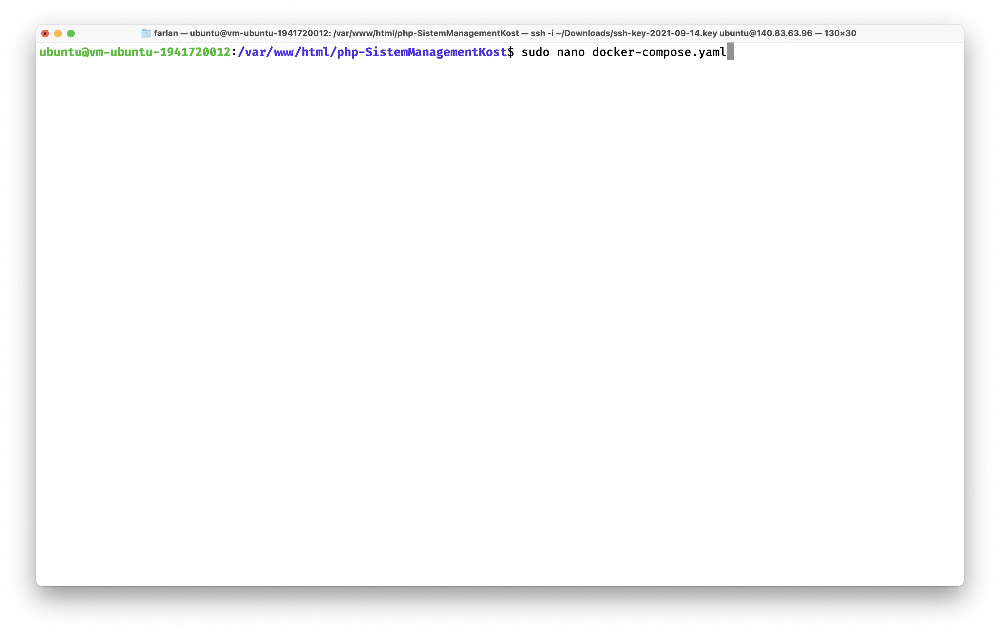
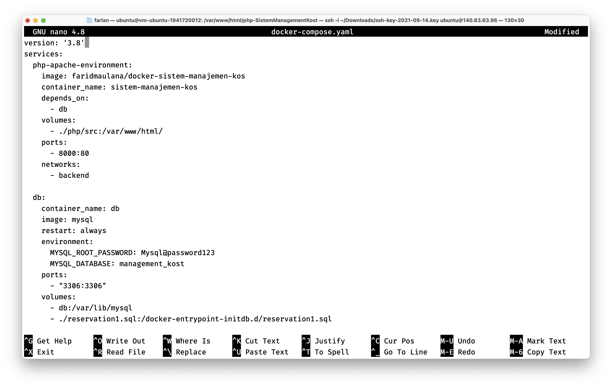
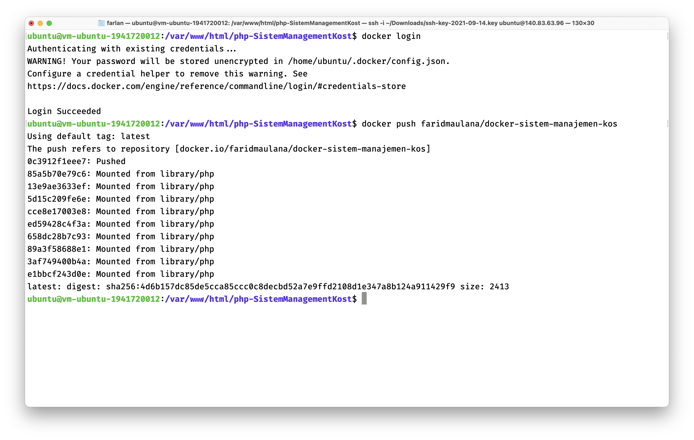
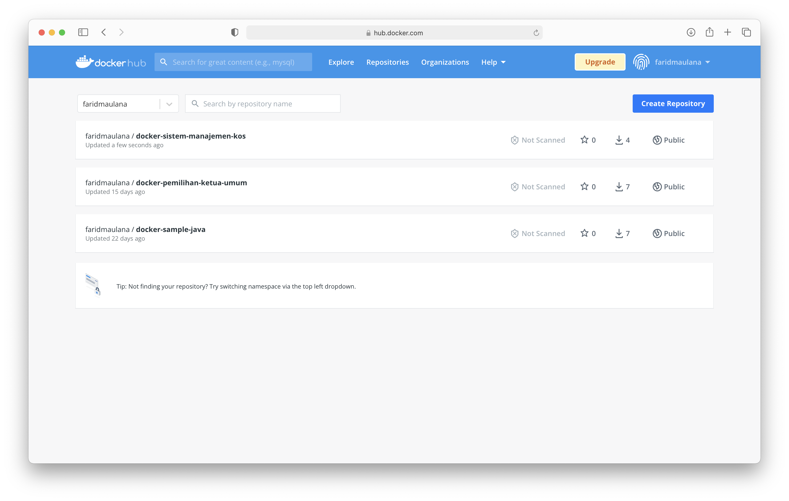

# Kuis 02

## Membuat Docker Image Project UTS

1. Masuk ke dalam direktori project UTS dan buat file Dockerfile

2. Isi file Dockerfile

3. Membuat image dari project UTS

4. Membuat container dari project UTS

5. Membuat file docker-compose.yaml

6. Isi docker-compose.yaml

7. Login ke docker hub dan push project

8. Hasil push project ke docker hub
