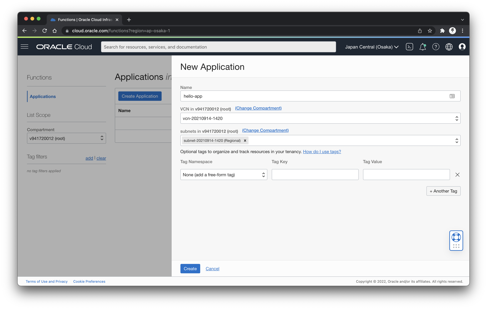

# 13 - Serverless

## Tujuan Pembelajaran
1. Mahasiswa dapat mengetahui secara jelas mengenai Serverless

## Hasil Praktikum

### Membuat Application dan Function

1. Masuk ke halaman Applications yang ada di Developer Services

2. Membuat Aplikasi baru dengan nama hello-app dan VCN serta Subnet yang sudah ada

3. Hasil create Aplikasi

4. Mengaktifkan Cloud Shell

5. Melihat list context

6. Use the context for your region

7. Update the context with the function's compartment ID

8. Provide a unique repository name prefix to distinguish your function images from other people’s

9. Membuat token autentikasi

10. Login Registry menggunakan token autentikasi sebagai passwordnya

11. Verify your setup by listing applications in the compartment

12. Generate 'hello-world'

13. Masuk ke direktori hello-world

14. Deploy function

15. Invoke function

16. Melihat informasi function beserta invoke endpoint-nya

### Memanggil Function

1. Memanggil function menggunakan oci-cli

